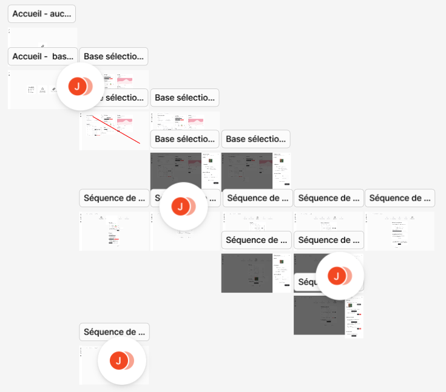

> [Table des matières](/README.md)

# Atlanta

> Accéder au [répertoire](https://github.com/samucapte/atlanta)

Atlanta est le logiciel conçu pour communiquer avec [Loch](https://github.com/samucapte/loch).
Il utilise le protocole [Pigeon](https://github.com/samucapte/pigeon) et est programmé en Go.

### Connexion de Loch

Atlanta détecte une base compatible automatiquement lorsqu'elle est connectée via un fil USB à un ordinateur exécutant Atlanta.
Si ce n'est pas le cas, il peut être utile de redémarrer Loch.

> Loch doit être configuré pour la communication avec Pigeon (mode _setup_ ou mode _manuel_).

###### Valider la connexion

| Mode     | Opération                                                                                       |
| -------- | ----------------------------------------------------------------------------------------------- |
| CLI      | Exécuter `atlanta status`                                                                       |
| Logiciel | La base est détectée automatiquement.<br/>Au besoin, **rafraîchir les bases** dans l'interface. |

---

### Configuration

La configuration de Loch peut être entièrement décrite par un fichier `.yml`. Voir un [exemple](https://github.com/SAMuCaptE/atlanta/blob/develop/loch.yml).

Ce fichier est utilisé par Atlanta pour déterminer la configuration durant une mission et peut être regénéré en retour de mission.
Il est suggéré de le **conserver** puisqu'il donne leur sens aux valeurs qui ont été recueillies.

<details>
<summary>Consulter les champs de la configuration</summary>

```yaml
name: loch # Nom de la mission, 1 à 32 caractères

# Valeurs entre le 1 janv 2000 et 31 déc 2063
start_date:
  year: 2025
  month: 1
  date: 1
  hours: 0
  minutes: 0

# Valeurs entre le 1 janv 2000 et 31 déc 2063
# Doit être après la date de début de la mission
retrieval_date:
  year: 2025
  month: 12
  date: 31
  hours: 23
  minutes: 59

# Liste de tous les capteurs présents
# Minimum de 1 capteur
# Maximum de 6 capteurs
sensors:
  - mux: 0 # Voir les valeurs permises sur le circuit
    type: ph # 'ph', 'temperature', 'conductivity'
    weekly: true
    reference: 2 # Numéro du capteur de référence (souvent celui de température)
    # Liste de toutes les prises de mesures souhaitées. Entre 1 et 7.
    collections:
      - day: 0 # Entre 0 et 6, à saisir si le capteur est hebdomadaire
        hours: 4 # Entre 0 et 23
        minutes: null # Entre 0 et 59, à saisir si le capteur n'est pas hebdomadaire
```

</details>

<br/>

Atlanta peut toujours déterminer si une configuration est valide en exécutant: `atlanta check --config [config.yml]`.

---

### Utilisation

> Atlanta peut être utilisé comme **CLI** ou comme **logiciel standard**.

#### CLI

La version dans le terminal d'Atlanta permet de faire toutes les [opérations implémentées](https://github.com/samucapte/atlanta/?tab=readme-ov-file#fonctionnalit%C3%A9s-pr%C3%A9vues).
<br/>
Les commandes disponibles sont listées en exécutant `atlanta --help`.
<br/>
Chaque commande individuelle peut être détaillée de la même manière: `atlanta [command] --help`.

#### Logiciel

> Cette partie d'Atlanta n'est pas terminée.

Une partie du CLI est disponible sous forme d'interface graphique plus simple. Elle est disponible en ouvrant `atlanta.exe` sur Windows ou en exécurant `atlanta ui` dans le terminal.

Une page web s'ouvre avec Atlanta disponible. Si ce n'est pas le cas, naviguer vers [http://localhost:8888](http://localhost:8888).

La configuration de Loch peut y être faite mais le rapatriement des données doit être exécuté dans le terminal.

##### Plans futurs

Les maquettes d'Atlanta sont visibles ci-bas. Elles sont détaillées dans le [fichier Figma](./atlanta/atlanta.fig) inclus et exportées dans [ce répertoire](./atlanta).


