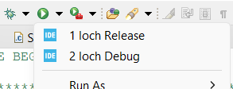

> [Table des matières](/README.md)

# Loch

> Accéder au [répertoire](https://github.com/samucapte/loch)

Loch est le programme embarqué prenant des mesures au courant des missions effectuées.
 
Il se base sur un microcontrôleur [STM32L053R8](https://www.st.com/en/evaluation-tools/nucleo-l053r8.html).

Le code est en C et utilise la librairie de STM32 (HAL) ainsi qu'une version statique de [protobuf](https://github.com/protobuf-c/protobuf-c).
 
La **librairie standard de C n'est pas utilisée** par soucis d'espace disponible.

---

### Outils et composants

- **Microcontrôleur**: [STM32L053R8](https://www.st.com/en/evaluation-tools/nucleo-l053r8.html)
- **Carte de développement**: [STM32L053R8 Nucleo-64](https://www.st.com/en/evaluation-tools/nucleo-l053r8.html)
- **Logiciel de développement**: [STM32CubeDE v1.14.1](https://www.st.com/en/development-tools/stm32cubeide.html)

---

### Périphériques

Les périphériques sont initialisés dans le fichier `.ioc` associé au projet.

Ils doivent être activés avant d'être utilisés par le programme embarqué. (voir [`board-utils.c`](https://github.com/SAMuCaptE/loch/blob/main/Core/Src/board-utils.c))

| Rôle                               | Périphérique | Nom PCB           | Nom code        | Notes                                                                                                |
| ---------------------------------- | ------------ | ----------------- | --------------- | ---------------------------------------------------------------------------------------------------- |
| Communication debug                | lpuart       | LPUART (J9)       | `huart_debug`   | <ul><li>baud: 9600</li><li>interrupt: activé</li><li>DMA RX: activé, HIGH, mode circulaire</li></ul> |
| Communication capteurs / satellite | uart2        | USART2 (U4 / J32) | `huart_sensors` | <ul><li>baud: 9600</li><li>interrupt: désactivé</li><li>DMA : désactivé</li></ul>                    |
| Mémoire A                          | I2C2         | I2C2 (vers U8)    | `hi2c_memory`   | 100 kHz                                                                                              |
| Mémoire B                          | I2C1         | I2C1 (vers U5)    | `hi2c1_ptr`     | 100 kHz                                                                                              |
| Watchdog                           | -            | -                 | `wwdg_ptr`      | Doit être rafraîchi à toutes les secondes: `HAL_WWDG_Refresh(wwdg_ptr);`                             |

**Note**: Les canaux UART du devkit sont inversés. Le fil USB de est associé au UART2 et le LPUART est utilisé pour **un** capteur (muliplexeur indisponible). La configuration dans le `.ioc` doit alors être inversée et l'assignation des variables dans le fichier `main.c` aussi.

#### Regénérer la configuration

> Peut être nécessaire avant de compiler la première fois

Consulter les étapes

- Modifier le fichier la configuration `.ioc` avec l'éditeur visuel et sauvegarder.
- Défaire la modification et sauvegarder à nouveau.
- Accepter la génération du code automatique.

---

### Compilation

- Choisir le mode d'opération dans [`loch-info.h`](https://github.com/SAMuCaptE/loch/blob/main/Core/Inc/loch-info.h)

  - `MODE_REGULAR`: Prise de données seulement, exécution du code compris dans [`loch.c`](https://github.com/SAMuCaptE/loch/blob/main/Core/Src/loch.c)
  - `MODE_SETUP`: Interactions avec [Atlanta](https://github.com/samucapte/atlanta) via [Pigeon](https://github.com/samucapte/pigeon) seulement, exécution du code compris dans [`setup.c`](https://github.com/SAMuCaptE/loch/blob/main/Core/Src/setup.c)
  - ~~`MODE_RETRIEVAL`: Inutilisé~~
  - `MODE_TESTS`: Exécution du code compris dans [`test.c`](https://github.com/SAMuCaptE/loch/blob/main/Core/Tests/test.c) au lieu de la procédure classique
  - `MODE_MANUAL`: Choix manuel entre le mode régulier et le mode _setup_ selon le _jumper_ J22 (Voir [schéma du PCB](/pcb.md))
    > Le debugger n'est pas disponible dans ce mode par manque d'espace. Utiliser la compilation en mode _release_.

- Désactiver les logs dans [`debug.h`](https://github.com/SAMuCaptE/loch/blob/main/Core/Inc/debug.h) en définissant `#define SHOW_LOGS 0`

- Choisir le mode de compilation

  

- Connecter un STLink au connecteur J3 (Voir [schéma du PCB](/pcb.md))

- Programmer la base via CubeIDE

### Développement

Le développement à l'aide du debugger est disponible sur la carte de développement et sur le circuit imprimé, **sauf dans le mode manuel**.

Le programme débute toujours dans le fichier [`main.c`](https://github.com/SAMuCaptE/loch/blob/main/Core/Src/main.c) et suit la configuration choisie plus haut.

Loch ne fait **aucune allocation dynamique** de mémoire.
 
Tous les éléments de mémoire sont alors connus et définis avant le début du fonctionnement.

Il peut parfois être bénéfique de redémarrer la base avec le bouton reset ou en la débranchant de son alimentation après l'avoir programmée.

Les **logs** peuvent être ajoutés ou non à l'archive sans modifier la logique d'affaire (voir étapes de compilation).
