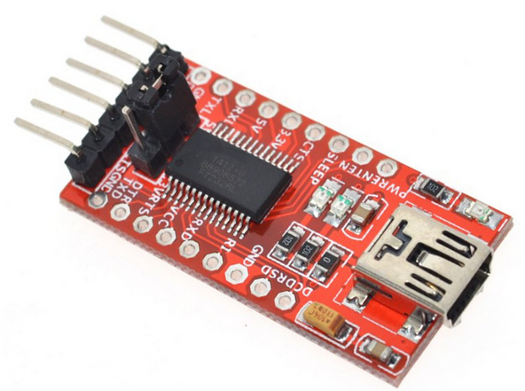
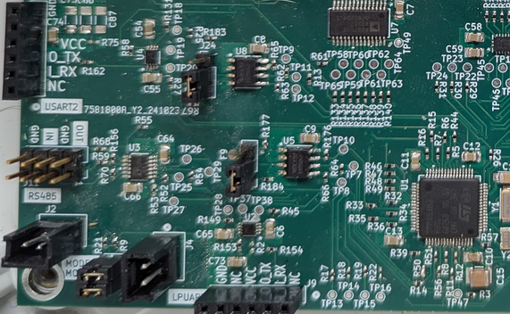
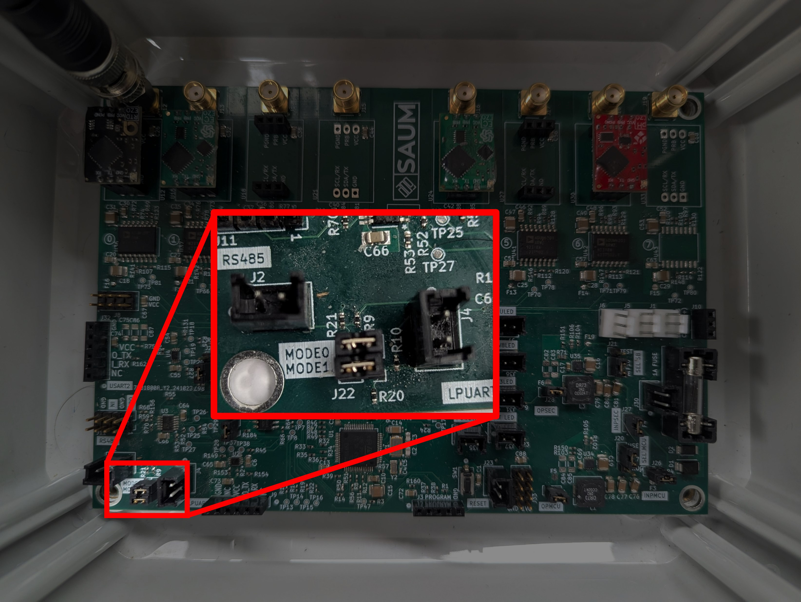
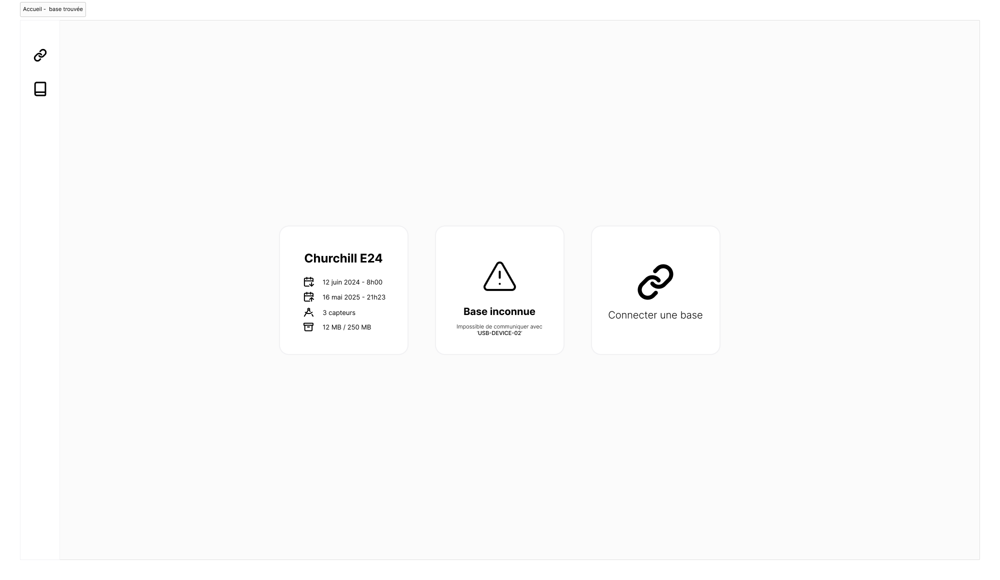

# Première utilisation

Ce document vise à fournir un résumé détaillé lors de la première utilisation d'une base.

## Étape 1

La première étape consiste à brancher le USB to UART dans le PCB plus précisement dans le connecteur LPUART.

Le module ci-dessus doit être branché de manière à que l'écriture (sérigraphie) corresponde avec celle écrite sur le PCB.

 

Il ne suffit plus que de brancher un câble Mini-USB dans le module USB to UART.
## Étape 2

Il faut télécharger le logiciel [Atlanta](https://github.com/SAMuCaptE/atlanta/releases) qui est l'interface entre l'ordinateur et la base. Une fois l'application téléchargée, s'il n'y aucune base de branchée, vous verrez l'image suivante:

Une fois la base connectée, il faut s'assurer que le mode soit comme montré dans l'image ci-dessous :

Ceci correspond au mode `setup`, mode qui permet d'interagir avec la base. Loch a deux modes:
- **Setup** : Ce mode permet de configurer la base avec les dates de récoltes de données, le type de capteur et permet de récolter les données en mémoire.

- **Run**: Ce mode permet à la base de commencer son processus normal de récolte des données une fois la base configurée.

Si l'application ne trouve toujours pas la base, vous pouvez appuyer sur le bouton `reset` pour remettre la base en mode setup. Ceci est une étape importante si vous avez changé le mode.

La page suivante devrait s'afficher et vous permettra de configurer la base avec le nombre de capteurs et les heures de récolte de données

Lors de la première connexion, le nom et les dates n'auront pas de symboles lisibles. Ceci est normal, il ne suffit que de la configurer une première fois pour que les données soient sauvegardées.

## Étape 3
Une fois la base configurée, vous pouvez enlever un cavalier ([voir cette image](./procedure/jumper.jpg)) servant à fixer le mode et appuyer sur le bouton reset pour que la base puisse commencer à récolter des données. Afin de vous assurer que la base ait bien été programmée, les capteurs s'allumeront un à un vous laissant savoir que la base a été configurée avec succès.
