> [Table des matières](/README.md)

# Procédure de mission

Ici sont décrites les étapes à effectuer pour bien utiliser Loch lors de missions.

## Table des matières

- [Références](#références)
- [Avant de partir en mission](#avant-de-partir-en-mission)
- [Transport](#transport)
- [Modifications](#modifications)
- [Mise à l'eau](#mise-à-leau)
- [Fin de la mission](#fin-de-la-mission)
- [Rapatriement des données](#rapatriement-des-données)

## Références

Cliquer pour consulter

| Français         | Abbréviation | Image                                             |
| ---------------- | ------------ | ------------------------------------------------- |
| Circuit imprimé  | PCB          | 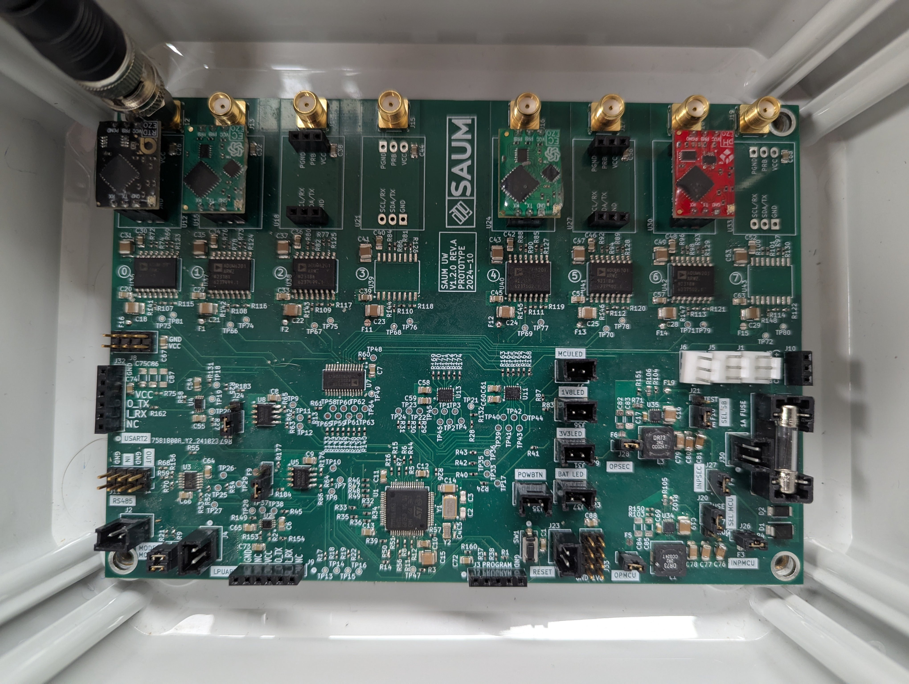                       |
| Connecteur SMA   | -            | 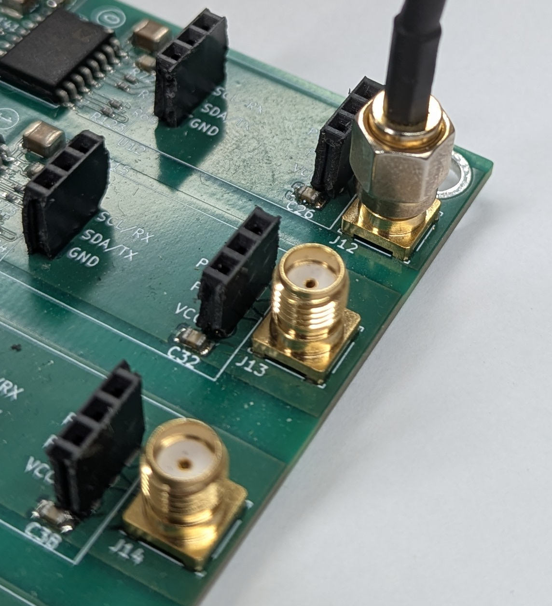 |
| Sachet de silice | -            | 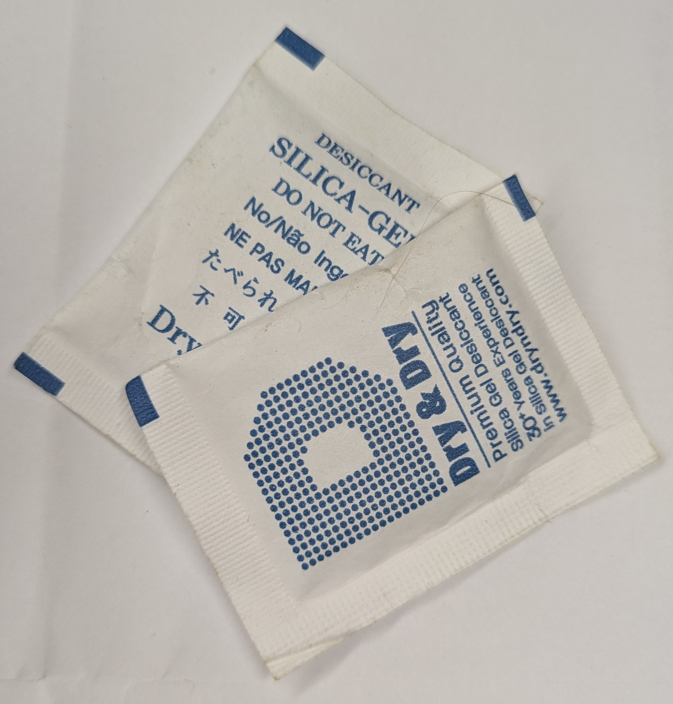         |
| Séparateur       | -            | 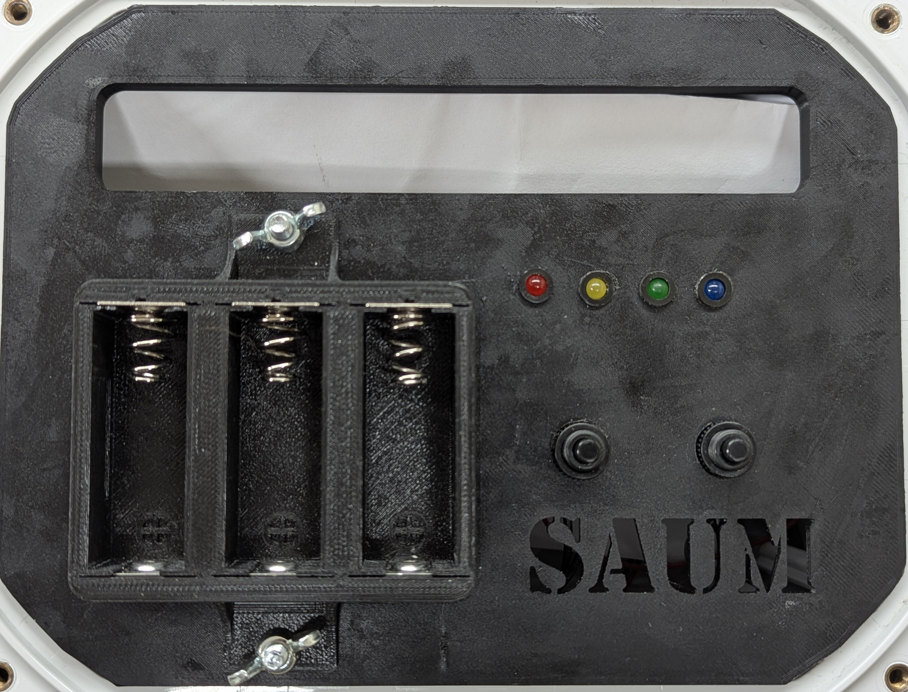         |
| _Jumper_         | -            | 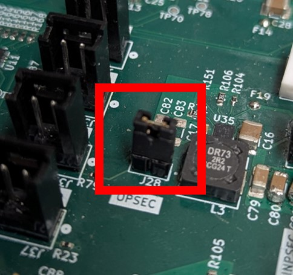                 |
| Choix du mode    | -            |          |

## Interface

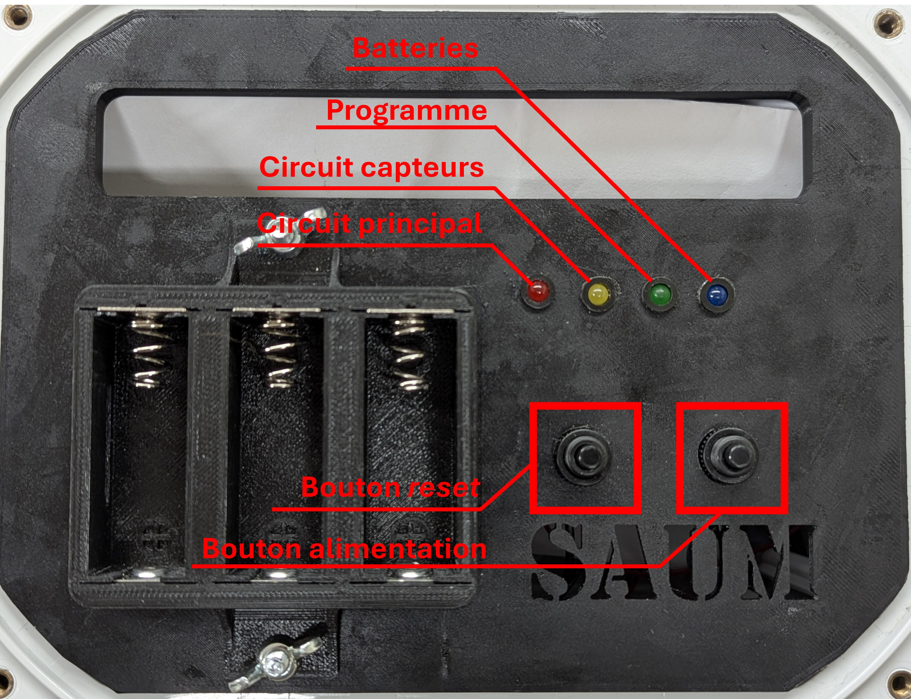

---

## Avant de partir en mission

### Caisson

- [ ] Valider que le PCB est bien installé (vis) dans le caisson.
- [ ] Valider que les sondes des capteurs sont bien installées dans les presse-étoupes. Ils doivent être suffisamment serrés pour empêcher la pénétration de l'eau.
- [ ] Faire de même pour le câble de communication.
- [ ] Valider que les connecteurs SMA des sondes sont vissés dans le PCB.
- [ ] Valider que le connecteur pour les batteries est bien installé.
- [ ] Installer le séparateur.

### PCB

- [ ] Valider les connexions du PCB d'alimentation via les LEDs.

### Calibrer les capteurs

> Cette procédure n'est pas complètement automatisée. Il faut faire une partie manuellement en se connectant aux capteurs directement.

- [ ] Activer le capteur 0. Le témoin lumineux du capteur clignote un instant.
- [ ] Transmettre les commandes de calibration (disponibles dans [les fiches techniques](/docs/Measures/sensor_documentation)) selon les instructions fournies. Utiliser un émulateur de terminal série tel que [uart-tool](https://github.com/SAMuCaptE/uart-tool).
  > Note: Il est possible que le capteur ne réponde pas facilement. Dans ce cas, il semblait plus facile de brancher un module UART<->USB fonctionnant à 5V directement dans le capteur et d'envoyer les commandes manuellement à l'aide d'un programme tel que [celui-ci](https://github.com/SAMuCaptE/uart-tool).
- [ ] Désactiver le capteur 0.
- [ ] Répéter 3 les dernières opérations pour tous les capteurs.
  > **Important:** Si les capteurs sont connectés sur le circuit, il ne faut pas allumer plusieurs capteurs simultanément, au risque d'endommager le système d'alimentation.
- [ ] ~~Sauvegarder la calibration dans la base en exécutant `atlanta calibrate`~~
  > La calibration via Atlanta n'est pas implémentée, mais elle ~~pourrait~~ devrait être automatisée via l'option `passthrough`.

### Programmer la base

- [ ] Mettre la base en **mode programmation** (mode = 0).
- [ ] Appuyer sur le bouton de redémarrage.
- [ ] Connecter Atlanta.
- [ ] Mettre à jour la configuration souhaitée dans Atlanta.
  - Déterminer la date de début et de fin de la mission. **Sélectionner le fuseau horaire du site de la mission pour utiliser les bonnes heures.**
  - Ajouter les capteurs selon leur position dans la station.
  - Configurer les capteurs selon le formulaire en place, en commençant par les capteurs de température.
- [ ] ~~Effectuer la séquence de sanité~~.
- [ ] Confirmer la programmation en redémarrant la base (bouton de reset) et en rafraîchissant Atlanta.
- [ ] Sauvegarder le fichier de configuration sur l'ordinateur.

Il est aussi possible d'effectuer cette procédure via un terminal en suivant ces étapes:

- Modifier le fichier de configuration (par exemple `mission.yml`).
- Exécuter `atlanta program --config mission.yml`.
- Valider le fonctionnement avec `atlanta status`.
  > Note: Valider autant les capteurs présents que la version du programme. Porter attention à la date de début ainsi que les heures des mesures. Les fuseaux horaires peuvent compliquer le processus.

## Transport

Le bac de transport devrait contenir les éléments suivants:

- [ ] Caisson comprenant:
  - [ ] Capteurs
  - [ ] Sondes
  - [ ] PCB
  - [ ] Séparateur
- [ ] 4 batteries (3 pour le fonctionnement du système, 1 en surplus). **Ces batteries doivent être dans la cabine si elles sont transportées en avion.** Imprimer [ces documents](/procedure/batteries) et les conserver avec les batteries.
- [ ] Sachets de silice
- [ ] 3 m de chaine en acier
- [ ] 10 m de cable en acier
- [ ] 100 m de corde jaune en polypropylène
- [ ] 3 anses d'acier
- [ ] Ancre de 20 lbs _(peut être omise si une ancre peut être conçue sur place)_
- [ ] Tube de graisse mécanique _(peut être omise)_

Outils requis:

- [ ] Pinces à bec plat
- [ ] Tournevis étoile
- [ ] Marteau
- [ ] Ordinateur portable
- [ ] Embarcation pour se rendre au lieu de déploiement

---

## Vérifications

Assurer que le noeud <i>bowline</i> de la corde jaune autour de l'oeillet du câble d'acier est bien solide. Sinon le refaire.

<table>
<tbody>
<tr>
<td>
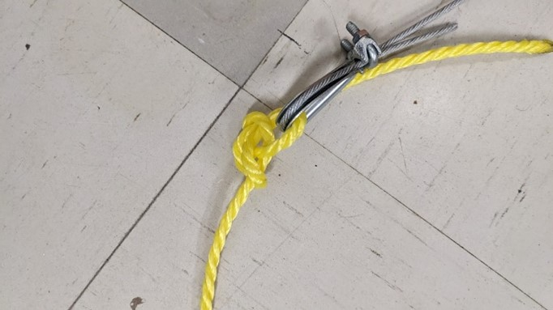
</td>
<td>
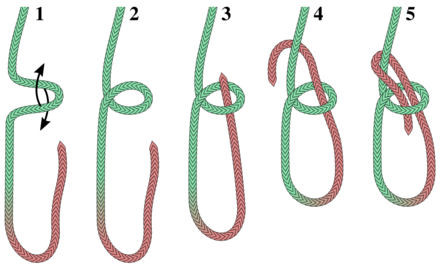
</td>
</tr>
</tbody>
</table>

Assurer que le noeud <i>icicle hitch</i> de la corde jaune autour du pieu est bien solide. Sinon le refaire.

<table>
<tbody>
<tr>
<td>
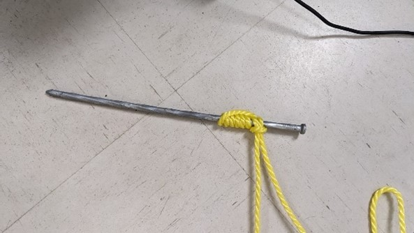
</td>
<td>
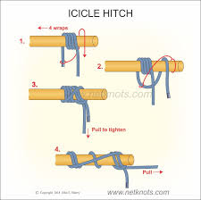
</td>
</tr>
</tbody>
</table>

Assurer que les 3 anses sont bien serrés. Les serrer avec des pinces au besoin.

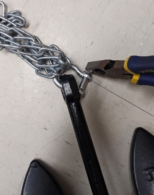

## Modifications

Certains paramètres peuvent être ajustés pour ajuster le système à l'environnement cible. Ces modifications sont optionnelles.

Consulter la liste des modifications possibles

### Modifier la longueur de la chaine d'acier

Afin d'ajuster la hauteur de la base par rapport au fond marin, utiliser les pinces pour dévisser les anses aux deux extrémités de la chaine et modifier l'arrangement de la chaine pour la rendre plus longue.

### Modifier le lest

Retirer l'anse attaché à l'ancre et fixer la chaine autour du nouveau lest.

## Mise à l'eau

### Mise en route de la prise de mesures

- [ ] Ouvrir le couvercle.
- [ ] Retirer le séparateur.
- [ ] Valider que le transport n'a pas altéré la mise en place effectuée aux étapes précédentes.
- [ ] Valider que le PCB est en **mode mission** (mode = 1).
- [ ] Ajouter des sachets de silice.
- [ ] Insérer les batteries.
- [ ] Replacer le séparateur.
- [ ] Retirer les protections autour des sondes. (Conserver ces protections pour la fin de la mission)
- [ ] Enfoncer le bouton de redémarrage. Cette opération débute la prise de mesures. **Noter l'heure**. Elle permettra d'obtenir le moment des mesures effectuées.
- [ ] Appuyer sur le bouton d'alimentation. Les 4 témoins lumineux s'allument.
  > **Si ce n'est pas le cas, l'alimentation est fautive ou le mode n'est pas bon.**
- [ ] Valider que le joint d'étanchéité est bien positionné.
- [ ] Valider qu'il y a suffisamment de graisse autour du caisson (pour aider au joint d'étanchéité). En ajouter au besoin. (_Facultatif_)
- [ ] Refermer le couvercle et visser les vis.

### Déploiement

- [ ] Démarrer la [prise de mesures](#mise-en-route-de-la-prise-de-mesures).
- [ ] Fixer le pieu qui est connecté à la corde jaune sur la berge.
- [ ] Entrer dans l'embarcation.
- [ ] Se rendre au point de mouillage et déposer l'ancre, suivie du caisson.
- [ ] Noter l'heure du déploiement.
- [ ] Revenir à la berge.
- [ ] Si la corde jaune est trop lousse, la raccourcir en faisant un noeud. Prendre garde à ne pas ajouter de tension dans le système.

---

## Fin de la mission

- [ ] Dans l'embarcation, suivre la corde jaune jusqu'à arriver au-dessus de la base. Tirer la totalité de la base à l'intérieur de l'embarcation.
- [ ] Noter l'heure.
- [ ] Revenir sur la berge.
- [ ] Retirer le pieu qui retient la corde jaune.
- [ ] Attendre que le caisson sèche (ou éponger le plus d'eau possible s'il faut arrêter les mesures rapidement).
- [ ] Retirer les vis, ouvrir le caisson et **enlever les batteries**.
  > Note: Les batteries doivent être en main lors du transport. (Voir le détail considérant le [transport](#transport))
- [ ] Refermer le caisson.
- [ ] Ranger le matériel et le système.

---

## Rapatriement des données

- [ ] Connecter Atlanta.
- [ ] Exporter les données dans le format souhaité en exécutant `atlanta retrieve --format <csv|json>`.
- [ ] Exporter la configuration de la base `atlanta status --output config.yml`.
- [ ] S'il y a des erreurs, exporter la configuration sous forme binaire, sans modifier les interpréter les mesures: `atlanta retrieve --raw`.

---
